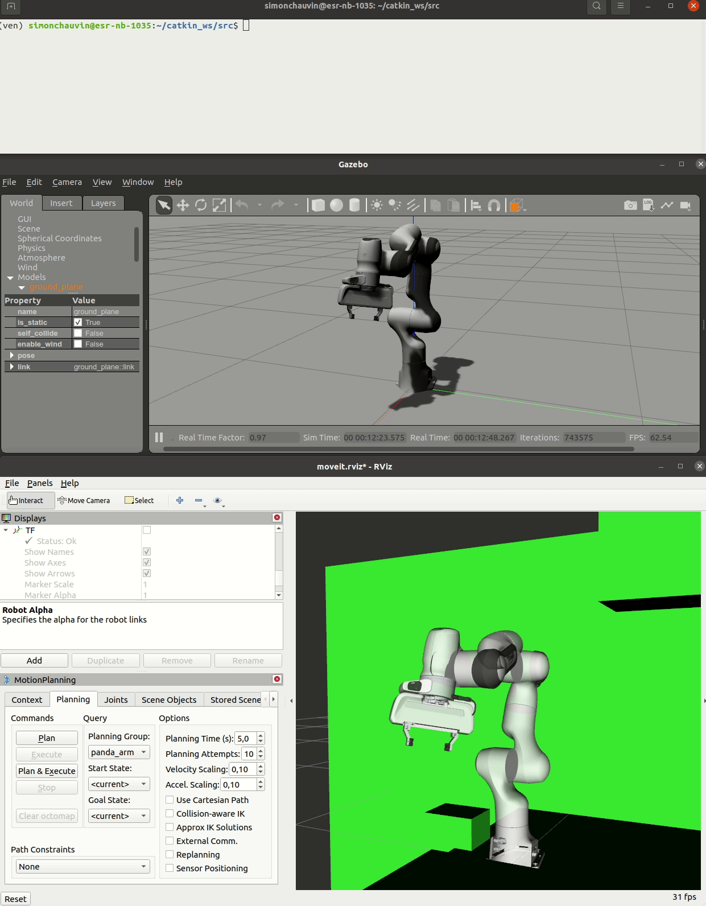
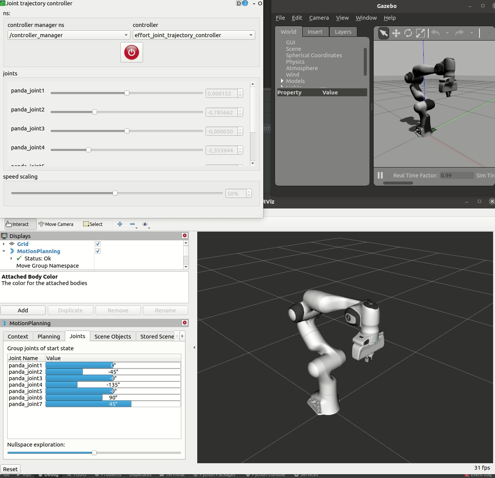

- `Co`ntrol with `M`oveIt of `Pa`nda robot in `Py`thon

- :speaking_head: `CoMPaPy` = `[kɔm papi]` :older_man: (:fr:)

- :construction: _work in progress_ :construction_worker:

# `CoMPaPy`

## :eyeglasses: description

**"a simple python interface for basic control of a real [panda robot](https://www.franka.de/)
with [moveit](https://ros-planning.github.io/moveit_tutorials/doc/getting_started/getting_started.html)"**

- using only **official** and **maintained** repos: [`franka_ros`](https://frankaemika.github.io/docs/franka_ros.html)
  and [`MoveIt`](https://ros-planning.github.io/moveit_tutorials/doc/getting_started/getting_started.html)
- two modes: "`rviz` only" and "real panda"
- no `cpp`, just `python`

## :warning: limitations

- rely on `ROS` :confused:
- only tested on the following combination
    - (`ubuntu 20`, `noetic`, `libfranka 0.10.0`, `franka_ros 0.10.1`)
    - _todo: docker_
- require switching to a real-time kernel
- require lots of installations
    - _todo: docker_
- only basic actions
    - `move_j`
    - `move_l`
    - `open_gripper`
    - `close_gripper`
- may require some parameter tuning
    - e.g. for the cartesian plan in `move_l`
    - _todo: collect params in config file_
- control `panda_link8` instead of the gripper :weary:
    - todo: `https://answers.ros.org/question/334902/moveit-control-gripper-instead-of-panda_link8-eff/`
- no `gazebo` integration
    - todo

## :wrench: installation

notes

- installing `libfranka` and `franka_ros` with `sudo apt install ros-noetic- ...` is not an option at the time of
  writing: it gives incompatible versions

create a dir for all packages

```
mkdir -p ~/catkin_ws/src
cd ~/catkin_ws/src
```

### :dart: final structure

<details>
  <summary>click to expand</summary>

```
tree ~/catkin_ws/src -d -L 2

.
├── compapy
│     ├── config
│     ├── launch
│     └── scripts
├── franka_ros
│     ├── cmake
│     ├── franka_control
│     ├── franka_description
│     ├── franka_example_controllers
│     ├── franka_gazebo
│     ├── franka_gripper
│     ├── franka_hw
│     ├── franka_msgs
│     ├── franka_ros
│     └── franka_visualization
├── geometric_shapes
│     ├── cmake
│     ├── include
│     ├── src
│     └── test
├── moveit
│     ├── moveit
│     ├── moveit_commander
│     ├── moveit_core
│     ├── moveit_experimental
│     ├── moveit_kinematics
│     ├── moveit_planners
│     ├── moveit_plugins
│     ├── moveit_ros
│     ├── moveit_runtime
│     └── moveit_setup_assistant
├── moveit_msgs
│     ├── action
│     ├── dox
│     ├── msg
│     └── srv
├── moveit_resources
│     ├── dual_panda_moveit_config
│     ├── fanuc_description
│     ├── fanuc_moveit_config
│     ├── moveit_resources
│     ├── panda_description
│     ├── panda_moveit_config
│     ├── pr2_description
│     ├── prbt_ikfast_manipulator_plugin
│     ├── prbt_moveit_config
│     ├── prbt_pg70_support
│     └── prbt_support
├── moveit_tutorials
│     ├── doc
│     ├── _scripts
│     ├── _static
│     └── _themes
├── moveit_visual_tools
│     ├── include
│     ├── launch
│     ├── resources
│     └── src
├── panda_moveit_config
│     ├── config
│     └── launch
├── rviz_visual_tools
│     ├── icons
│     ├── include
│     ├── launch
│     ├── resources
│     ├── src
│     └── tests
├── srdfdom
│     ├── include
│     ├── scripts
│     ├── src
│     └── test
└── ven
    ├── bin
    ├── include
    ├── lib
    ├── lib64 -> lib
    └── share
```

</details>

### :pick: building from source

only tested with these versions ([source](https://frankaemika.github.io/docs/compatibility.html)):

| Robot system version | libfranka version | franka_ros version | Ubuntu / ROS    |
| -------------------- | ----------------- | ------------------ | ----------------|
| > = 5.2.0 (FR3)       | > = 0.10.0         | > = 0.10.0          | 20.04 / noetic  |

#### :mag: `libfranka`

follow [these instructions](https://frankaemika.github.io/docs/installation_linux.html#building-from-source)

#### :package: ROS meta-packages

##### :panda_face: `franka_ros`

follow [these instructions](https://frankaemika.github.io/docs/installation_linux.html#building-the-ros-packages)

- prefer `catkin build` to `catkin_make`

##### :hourglass_flowing_sand: real-time kernel

follow [these instructions](https://frankaemika.github.io/docs/installation_linux.html#setting-up-the-real-time-kernel)

- check with `uname -r`

##### :cartwheeling: `moveit_panda_config`

follow [these instructions](https://ros-planning.github.io/moveit_tutorials/doc/getting_started/getting_started.html)

- prefer `~/catkin_ws/src` to `~/ws_moveit/src`

##### :cartwheeling: `compapy`

```
cd ~/catkin_ws/src
git clone https://github.com/chauvinSimon/compapy.git
cd ~/catkin_ws/
catkin build
```

#### :performing_arts: `venv`

```
cd ~/catkin_ws/src
python3 -m venv ven --system-site-packages
source ven/bin/activate
pip install -r requirements.txt
```

#### :pencil2: `source_catkin` alias in `~/.bashrc`

this may be useful

```
alias source_catkin="source ~/catkin_ws/devel/setup.bash; source ~/catkin_ws/src/ven/bin/activate; cd ~/catkin_ws/src"
```

#### :bug: troubleshooting

> "Unable to find either executable 'empy' or Python module 'em'... try installing the package 'python-empy'"

- `(ven) ~/catkin_ws$ catkin build -DPYTHON_EXECUTABLE=/usr/bin/python3 -DPYTHON_INCLUDE_DIR=/usr/include/python3.8`

### :writing_hand: pycharm

follow [this great video](https://www.youtube.com/watch?v=lTew9mbXrAs) (Peter Mitrano)

```
source ~/catkin_ws/src/ven/bin/activate
python -c "import ros; print(ros.__file__)"

# if not using the alias
source ~/catkin_ws/devel/setup.sh
```

find the path to `pycharm.sh` either with `JetBrains ToolBox` or with

```
sudo apt install locate
sudo updatedb
locate pycharm.sh
```

I prefer to run python scripts from `pycharm` :blush:

- `Working directory` is configured to be `~/catkin_ws/src/compapy`
- if you prefer using the terminal, you may need to `export PYTHONPATH=${PYTHONPATH}:${PWD}`
  against `ModuleNotFoundError` and `ModuleNotFoundError`

## :arrow_forward: starting real robot

:warning: keep the emergency button close to you :rescue_worker_helmet:

follow the [fci](https://frankaemika.github.io/docs/getting_started.html) instructions to configure `fci`

switch on the robot

in [`http://172.16.0.2/desk/`](http://172.16.0.2/desk/)

- release joints
- activate `fci`
- Re-initialize Hand
- choose "Execution" mode

in a terminal

- `source_catkin` (alias)

## :stethoscope: verifications

_todo: test them all again_

### :phone: robot connection

```
ping 172.16.0.2
```

### :video_game: `move group` python Interface

no real robot needed: follow
this [tutorial](https://ros-planning.github.io/moveit_tutorials/doc/move_group_python_interface/move_group_python_interface_tutorial.html#move-group-python-interface)

```
roslaunch panda_moveit_config demo.launch rviz_tutorial:=true
rosrun moveit_tutorials move_group_python_interface_tutorial.py
```

<details>
  <summary>:heavy_check_mark: expected result</summary>


</details>

### :book: `libfranka`

in `execution` mode

```
~/libfranka/build/examples/communication_test 172.16.0.2
```

### :popcorn: `franka_example_controllers`

in `execution` mode

```
roslaunch franka_visualization franka_visualization.launch robot_ip:=172.16.0.2 load_gripper:=true

# move a bit the gripper from its start pose before running this
roslaunch franka_example_controllers move_to_start.launch robot_ip:=172.16.0.2
```

### :tv: `rviz` visualization

in `programming` mode

```
roslaunch franka_visualization franka_visualization.launch robot_ip:=172.16.0.2 load_gripper:=true
```

- move the cooperative robot manually (press the two buttons on the gripper)
- see the corresponding motion in `rviz`

### :computer_mouse: `rviz` control

in `execution` mode

```
roslaunch panda_moveit_config franka_control.launch robot_ip:=172.16.0.2 load_gripper:=true
```

in `rviz`:

- add the `MotionPlanning` plugin
- drag the interactive marker to some the goal state
- click `Plan` and the `Execute`
- try different planning settings (cartesian path, speed, planning pipeline ...)
- try to display and hide the different visualisation tools
- I personally like the `Joints` tab in `MotionPlanning` plugin

### :clamp: gripper

in `execution` mode

```
# run only one of
roslaunch franka_gripper franka_gripper.launch robot_ip:=172.16.0.2
roslaunch franka_control franka_control.launch robot_ip:=172.16.0.2
roslaunch panda_moveit_config franka_control.launch robot_ip:=172.16.0.2 load_gripper:=true
roslaunch compapy real.launch robot_ip:=172.16.0.2
```

alternatively to the real robot, `gazebo` can be used

```
roslaunch panda_moveit_config demo_gazebo.launch
```

then

```
# close the gripper
rostopic pub --once /franka_gripper/grasp/goal franka_gripper/GraspActionGoal "goal: { width: 0.022, epsilon:{ inner: 0.005, outer: 0.005 }, speed: 0.1, force: 5.0}"

# open the gripper
rostopic pub --once /franka_gripper/move/goal franka_gripper/MoveActionGoal "goal: { width: 0.08, speed: 0.1 }"
```

<details>
  <summary>:heavy_check_mark: expected result</summary>



</details>

### :performing_arts: gazebo

```
roslaunch panda_moveit_config gazebo.launch
```

install and run `rqt_joint_trajectory_controller`

```
sudo apt install ros-noetic-rqt-joint-trajectory-controller
rosrun rqt_joint_trajectory_controller rqt_joint_trajectory_controller
```

<details>
  <summary>:heavy_check_mark: expected result</summary>



</details>

### :suspension_railway: `CoMPaPy` control

_todo: make it work with sim.launch_

in `execution` mode

```
roslaunch compapy real.launch robot_ip:172.16.0.2
```

in `pycharm`, with `Working directory` set to `~/catkin_ws/src/compapy`

```
python scripts/main_test_ref_actions.py
```

<details>
  <summary>:heavy_check_mark: expected result</summary>


</details>

## :checkered_flag: usage

### :evergreen_tree: scene

define obstacles in [`obstacles.json`](config/obstacles.json)

visualize them with

```
roslaunch compapy sim.launch
```

in `pycharm`, with `Working directory` set to `~/catkin_ws/src/compapy`

```
python scripts/main_load_obstacles.py
```

<details>
  <summary>:heavy_check_mark: expected result</summary>


</details>

### :joystick: example

in `execution` mode

```
roslaunch compapy real.launch robot_ip:172.16.0.2
```

adapt and run [`main_example.py`](scripts/main_example.py)

in `pycharm`, with `Working directory` set to `~/catkin_ws/src/compapy`

```
python scripts/main_example.py
```

## :+1: acknowledgements

the following resources helped me understand how to control the robot

- [Panda Programming Guide](https://usermanual.wiki/Document/PandaProgrammingGuide.1809781175/help) (Ahmad Al Attar)
- [`franka_ros_interface`](https://github.com/justagist/franka_ros_interface) (Saif Sidhik)
- [`DE3-Panda-Wall`](https://de3-panda-wall.readthedocs.io/en/latest/index.html) (Keith Li, Daniel Yin, Zachary Yamaoka)
- [`panda-gazebo`](https://rickstaa.dev/panda-gazebo) (Rick Staa)
- [`frankx`](https://github.com/pantor/frankx) (Berscheid)
- [`moveit_python`](https://github.com/mikeferguson/moveit_python) (Michael Ferguson)